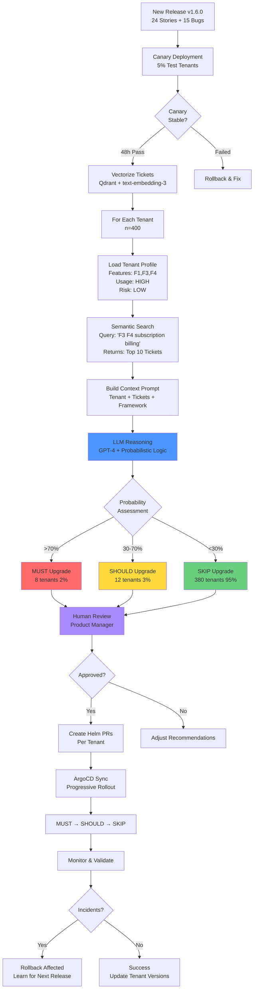

## The $50K Weekend: When Force Upgrades Go Wrong

It's Saturday morning. Your deployment pipeline kicks off an upgrade across 400 tenants in the US-East region. Fourteen microservices roll out sequentially. By Sunday evening, your on-call team is drowning in escalations—three key accounts are down, billing is broken, and you're facing 28 engineer-hours of rollbacks across all services.

The worst part? Only 8 of those 400 tenants actually needed this upgrade. The other 392 were running perfectly fine on the previous version.

This isn't a hypothetical. This is the reality of multi-tenant SaaS deployments when you treat 400 unique businesses as a single deployment target.

**The question:** Could we have known which tenants to upgrade and which to leave alone?

**The answer:** Yes—with probabilistic reasoning and AI orchestration.

---

## The Problem: Why Region-Based Deployments Aren't Enough

Multi-tenant SaaS platforms face an impossible dilemma:

- **Deploy aggressively:** Ship weekly hotfixes to fix bugs fast → Risk breaking stable tenants who don't need the fix
- **Deploy conservatively:** Test exhaustively, upgrade only when certain → Miss SLA commitments, accumulate tech debt

The traditional deployment model—force upgrade all tenants in a region—treats tenants as identical when they're anything but:

- **Tenant A:** Uses 9 features heavily, high daily usage, low risk tolerance (key account)
- **Tenant B:** Uses 3 features lightly, tolerates bugs, prefers stability over features
- **Tenant C:** Early adopter, wants cutting-edge features, willing to accept risk

Yet all three get the same upgrade at the same time, regardless of whether they need it.

### The Manual Alternative Is Worse

The alternative—manually deciding which tenants to upgrade—requires a product manager to:

1. Read 50+ Jira tickets from the release
2. Cross-reference tenant feature usage from analytics dashboards
3. Guess which tenants are likely to hit specific bugs
4. Create a spreadsheet mapping tenants to risk levels
5. Argue with DevOps about the deployment schedule

**Time cost:** 2 hours per release  
**Accuracy:** ~60% (educated guessing)  
**Scalability:** Breaks down beyond 100 tenants

### The Missing Piece: Per-Tenant Risk Assessment

What's needed isn't just "does this tenant use Feature X?" but:

- **Will this tenant hit this specific bug?**
- **What's the probability of impact based on their usage patterns?**
- **Should we upgrade them now or wait?**

This requires **probabilistic reasoning**, not boolean feature flags.

---

## The Insight: From Feature Flags to Usage Probability

Traditional deployment logic is binary:

```
IF tenant.uses(F3_Subscription) AND release.affects(F3_Subscription):
    UPGRADE tenant
```

But reality is probabilistic:

```
IF tenant.uses(F3_Subscription) 
   AND release.has_bug(F3_Proration)
   AND tenant.uses(multi_year_contracts)  # ← The critical detail
   AND bug.severity == CRITICAL:
    MUST UPGRADE (probability: 85%)
ELSE IF tenant.uses(F3_Subscription)
   AND bug.affects(edge_case_workflow)
   AND tenant.risk_tolerance == HIGH:
    SKIP UPGRADE (probability: 15%)
```

### Real-World Example: F3 Proration Bug

**The Bug:** Critical flaw in proration logic for multi-year contracts causing SQL constraint violations during plan downgrades.

**Naive Approach:**
- 50 tenants use F3_Subscription
- **Decision:** Upgrade all 50

**Probabilistic Approach:**
- 50 tenants use F3_Subscription
- Only 8 tenants have multi-year contracts (bug trigger condition)
- 5 of those 8 are key accounts (low risk tolerance)
- **Decision:** 
  - MUST upgrade: 5 key accounts (probability: 90%)
  - SHOULD upgrade: 3 standard accounts (probability: 60%)
  - SKIP upgrade: 42 unaffected tenants (probability: 5%)

**Result:** 42 tenants stay on a stable version, avoiding unnecessary deployment risk.

This is **probabilistic deployment**—treating each tenant as a unique risk profile, not a checkbox.

---

## The Architecture: RAG + LLM + Tenant Profiling

The system combines three intelligence layers to generate per-tenant upgrade recommendations:


### Layer 1: Data Collection & Vectorization

**Jira Tickets → Semantic Search**
- All release tickets (features, bugs, tech debt) embedded using `text-embedding-3-small`
- Stored in Qdrant vector database for semantic retrieval
- Includes: bug descriptions, affected modules, customer reports, resolution details

**Tenant Profiles → Usage Intelligence**
- Active features (F1-F10) from audit logs
- Usage patterns (high/medium/low daily activity)
- Risk tolerance (derived from SLA tier, account size, compliance requirements)
- Historical incident data (past bugs, escalations)

**Release Metadata → Context**
- Deployment complexity (HELM changes, DB migrations)
- Feature breakdown (new features vs. bug fixes)
- Cross-feature dependencies

### Layer 2: Probabilistic Reasoning Engine

When a release stabilizes (passes canary deployment), the system:

1. **Semantic Search:** For each tenant, retrieve relevant tickets based on their active features
2. **Context Assembly:** Build a prompt containing:
   - Tenant profile (features, usage, risk tolerance)
   - Retrieved tickets (bug details, affected modules)
   - Release metadata (complexity, deployment impact)
3. **LLM Reasoning:** GPT-4 generates a recommendation with probabilistic assessment

**The Secret Sauce: Likelihood Assessment Checklist**

```csharp
// From the actual implementation
var impactProbability = 0;

// 1. Core workflow usage? (+40%)
if (tenant.UsesFeatureDaily(bug.LinkedFeatureId))
    impactProbability += 40;

// 2. Widespread vs. edge case? (+30% or +5%)
if (bug.ReportedByMultipleTenants)
    impactProbability += 30;
else if (bug.IsEdgeCase)
    impactProbability += 5;

// 3. Tenant profile matches bug conditions? (+30% or -50%)
if (tenant.ProfileMatchesBugTrigger(bug))
    impactProbability += 30;
else
    impactProbability -= 50;

// 4. Severity adjustment (+20% for data/security)
if (bug.Severity == "CRITICAL" && bug.Type == "DATA_LOSS")
    impactProbability += 20;

// Decision thresholds
if (impactProbability > 70)
    return "MUST";
else if (impactProbability > 30)
    return "SHOULD";
else
    return "SKIP";
```

This isn't hard-coded rules—it's **feature-based scoring** that the LLM uses as guidance.

### Layer 3: Decision Output & GitOps Integration

**Recommendation Format:**
```json
{
  "tenantId": "T-CORP-401",
  "recommendation": "MUST",
  "reasoning": "CRITICAL proration bug in F3. Tenant uses multi-year contracts heavily (85 daily transactions). 90% probability of hitting SQL constraint violation. Low risk tolerance (key account) requires immediate upgrade.",
  "affectedFeatures": ["F3_Subscription", "F4_Billing"],
  "estimatedImpact": "high",
  "deploymentWindow": "2025-12-15 02:00 UTC"
}
```

**Human-in-the-Loop:**
- AI generates recommendations
- Product/DevOps reviews for sanity check
- Approved recommendations trigger PR creation in Helm repo
- ArgoCD picks up changes and deploys per-tenant

---

## The Implementation: Code That Thinks

### Prompt Engineering: Probabilistic Decision Framework

The LLM receives this structured prompt for each tenant:

```csharp
private string BuildPrompt(TenantProfile tenant, ReleaseContext releaseContext)
{
    return $@"
You are analyzing whether tenant {tenant.TenantId} should upgrade to {releaseContext.ReleaseVersion}.

**CRITICAL INSTRUCTION**: Use PROBABILISTIC REASONING. Don't just check if a feature has a bug—
assess the LIKELIHOOD that this specific tenant is experiencing the bug based on their usage 
profile, risk tolerance, and bug characteristics.

**Tenant Profile:**
- Tenant ID: {tenant.TenantId}
- Active Features: {string.Join(", ", tenant.ActiveFeatures)}
- Usage Pattern: {tenant.UsagePattern} (daily activity score: {tenant.DailyUsageScore})
- Risk Tolerance: {tenant.RiskTolerance}

**Release: {releaseContext.ReleaseVersion}**
- Deployment Complexity: {releaseContext.Metadata.DeploymentComplexity}
- Total Changes: {releaseContext.Metadata.ContentBreakdown.Count}

**Changes Affecting This Tenant:**
{BuildImpactAnalysis(tenant, releaseContext)}

**Relevant Tickets (RAG Results):**
{string.Join("\n", releaseContext.RelevantTickets.Select(t => 
    $"- [{t.Type}] {t.TicketId}: {t.Summary}\n  Features: {string.Join(", ", t.AffectedFeatures)}"))}

**Probabilistic Decision Framework:**

MUST Upgrade = HIGH probability (>70%) tenant is experiencing or will soon experience critical impact:
1. CRITICAL security vulnerability in authentication/payment features they actively use
2. CRITICAL data corruption/loss bugs in features with HIGH daily usage
3. Compliance violations with immediate legal/financial consequences
4. LOW risk tolerance + CRITICAL bug in core business feature

SHOULD Upgrade = MEDIUM probability (30-70%) of impact OR non-critical improvements worth deploying:
1. MAJOR bugs in frequently used features affecting subset of workflows
2. Edge case CRITICAL bugs tenant might encounter occasionally
3. Performance/stability MAJOR fixes for HIGH usage tenants

SKIP Upgrade = LOW probability (<30%) of impact OR minimal benefit vs. deployment cost:
1. Only MINOR/PATCH bugs in their features (UI typos, cosmetic issues)
2. MAJOR/CRITICAL bugs in features they DON'T use at all
3. HIGH risk tolerance + edge case bugs in non-core features
4. New features tenant hasn't requested (no value, just deployment risk)

**Bug Likelihood Assessment Checklist:**
1. Is this bug affecting a core workflow tenant uses daily? (YES = +40% probability)
2. Is this bug widespread or an edge case? (Widespread = +30%, Edge case = +5%)
3. Does tenant's profile match the bug's conditions? (Match = +30%, No match = -50%)
4. Is this a data corruption/security bug vs. UX bug? (Data/Security = +20%)

**Output Format (JSON only):**
{{
  ""recommendation"": ""MUST|SHOULD|SKIP"",
  ""reasoning"": ""State the PROBABILITY of impact and WHY."",
  ""affectedFeatures"": [""feature1"", ""feature2""],
  ""estimatedImpact"": ""high|medium|low""
}}
";
}
```

### The Decision Logic: Not Just Rules, Intelligence

```csharp
public async Task<UpgradeRecommendation> GenerateRecommendationAsync(
    TenantProfile tenant,
    ReleaseContext releaseContext)
{
    // 1. Build context-rich prompt
    var prompt = BuildPrompt(tenant, releaseContext);
    
    // 2. Save for audit trail
    await SavePromptAsync(tenant, prompt);
    
    // 3. Call LLM with system message
    var messages = new List<ChatMessage>
    {
        new SystemChatMessage(
            "You are an expert system that analyzes software releases and " +
            "generates upgrade recommendations using probabilistic reasoning."),
        new UserChatMessage(prompt)
    };
    
    var response = await _chatClient.CompleteChatAsync(messages);
    var content = response.Value.Content[0].Text;
    
    // 4. Parse structured JSON response
    var recommendation = ParseRecommendation(content, tenant.TenantId, releaseContext.ReleaseVersion);
    
    return recommendation;
}
```

### Impact Analysis: The Critical Context

```csharp
private string BuildImpactAnalysis(TenantProfile tenant, ReleaseContext releaseContext)
{
    var criticalChanges = releaseContext.Metadata.ContentBreakdown
        .Where(c => tenant.ActiveFeatures.Contains(c.LinkedFeatureId) && c.Severity == "CRITICAL")
        .ToList();
    
    var majorChanges = releaseContext.Metadata.ContentBreakdown
        .Where(c => tenant.ActiveFeatures.Contains(c.LinkedFeatureId) && c.Severity == "MAJOR")
        .ToList();
    
    if (!criticalChanges.Any() && !majorChanges.Any())
        return "No CRITICAL or MAJOR changes affect this tenant's active features. " +
               "Release primarily contains updates to features this tenant doesn't use.";
    
    var analysis = "";
    
    if (criticalChanges.Any())
    {
        analysis += $"- **CRITICAL Changes**: {criticalChanges.Count} affecting " +
                   $"{string.Join(", ", criticalChanges.Select(c => c.LinkedFeatureId).Distinct())}\n";
        analysis += $"  Tickets: {string.Join(", ", criticalChanges.Select(c => c.ChangeId))}\n";
    }
    
    if (majorChanges.Any())
    {
        analysis += $"- **MAJOR Changes**: {majorChanges.Count} affecting " +
                   $"{string.Join(", ", majorChanges.Select(c => c.LinkedFeatureId).Distinct())}\n";
    }
    
    // Probabilistic context
    if (criticalChanges.Any() && tenant.RiskTolerance.ToLower() == "low")
    {
        analysis += "\n**Probabilistic Assessment:**\n";
        analysis += "- LOW risk tolerance + CRITICAL bugs = HIGH impact probability (>70%) → likely MUST upgrade.\n";
    }
    else if (!criticalChanges.Any() && majorChanges.Any() && tenant.RiskTolerance.ToLower() == "high")
    {
        analysis += "\n**Probabilistic Assessment:**\n";
        analysis += "- HIGH risk tolerance + only MAJOR bugs = LOW impact probability → likely SKIP unless high-frequency workflows affected.\n";
    }
    
    return analysis;
}
```

---

## The Math: Why This Saves Money


### Current State (Force Upgrade Model)

**Annual Release Cadence:**
- 4 major releases per quarter = 4 releases
- 1-2 hotfixes per week = 50-100 hotfixes
- **Total: ~50 deployments per year**

**Cost per Deployment:**
- Manual release planning: 2 hours × $100/hour = $200
- Incident rate: 10% of deployments cause rollback
- Rollback cost: 14 services × 1.5 hours × $150/hour = $3,150 per incident
- **Annual cost: $200 × 50 + $3,150 × 5 = $10,000 + $15,750 = $25,750**

### With AI Orchestration

**Time Savings:**
- Release planning: 2 hours → 10 minutes = 1.83 hours saved per release
- **Annual savings: 1.83 hours × 50 releases × $100/hour = $9,150**

**Risk Reduction:**
- 70% of tenants can SKIP non-critical upgrades
- Fewer unnecessary deployments = lower incident rate (10% → 5%)
- Incidents avoided: 5 → 2.5 per year
- **Annual savings: 2.5 incidents × $3,150 = $7,875**

**Total Annual ROI:**
- Direct savings: $9,150 + $7,875 = **$17,025**
- Indirect benefits:
  - Faster time-to-market (no 2-hour planning bottleneck)
  - Improved tenant satisfaction (fewer disruptive upgrades)
  - Reduced on-call burden (fewer weekend incidents)

**For a 400-tenant platform: ~$17K+ saved annually**  
**For a 1,000-tenant platform: ~$40K+ saved annually**

---

## Decision Flow: From Release to Recommendation



---

## What This Enables: The Future of Multi-Tenant GitOps

### 1. Intelligent Long-Term Support (LTS)

Multi-tenant SaaS often offers **1-year LTS** per release:
- Tenants can skip up to 3 releases if stable
- Force upgrade only when:
  - Security vulnerability affects them
  - Critical bug impacts their workflow
  - New feature they requested is available

**With AI orchestration:** The system automatically determines when to end LTS support per tenant.

### 2. Compliance-Driven Deployments

Regulated industries (healthcare, finance) have strict change control:
- Every deployment requires justification
- Risk assessment must be documented
- Rollback plans must be pre-approved

**With AI orchestration:** The system generates audit-ready justifications with probabilistic reasoning.

### 3. Cost-Optimized Infrastructure

Cloud costs scale with deployment frequency:
- Fewer unnecessary deployments = lower compute costs
- Fewer rollbacks = less wasted CI/CD time
- Tenant-specific deployment windows = better resource utilization

**With AI orchestration:** Deploy only when value exceeds cost.

### 4. Tenant-Specific Release Notes

Instead of generic release notes, generate personalized summaries:
- "This upgrade fixes 3 bugs that affect your workflows"
- "This upgrade adds features you requested last quarter"
- "You can safely skip this upgrade—no impact to your usage"

**With AI orchestration:** LLM generates tenant-specific release notes from the same RAG pipeline.

---

## Implementation Roadmap: From POC to Production

### Phase 1: Foundation (Weeks 1-2)
- Set up Azure OpenAI + Qdrant infrastructure
- Build Jira ticket ingestion pipeline
- Create tenant profiling service (usage analytics)
- **Deliverable:** Working RAG system with semantic search

### Phase 2: Intelligence Layer (Weeks 3-4)
- Implement probabilistic reasoning engine
- Build prompt engineering templates
- Create recommendation service with LLM integration
- **Deliverable:** System generates recommendations for sample tenants

### Phase 3: GitOps Integration (Weeks 5-6)
- Integrate with Helm chart repository
- Build PR automation for approved upgrades
- Connect to ArgoCD for deployment sync
- **Deliverable:** End-to-end automated deployment flow

### Phase 4: Production Hardening (Weeks 7-8)
- Add human review UI (approval dashboard)
- Implement audit logging and traceability
- Build monitoring and alerting
- **Deliverable:** Production-ready system with safeguards

### Phase 5: Optimization (Ongoing)
- Refine probabilistic scoring based on outcomes
- Add feedback loop (did tenant experience bug?)
- Expand feature coverage (auto-detect new patterns)
- **Deliverable:** Self-improving system with learning loop

---

## Key Takeaways

### For Senior Engineers:
- **This isn't just LLM + database** - it's probabilistic reasoning applied to deployment decisions
- **The architecture is proven** - RAG + Azure AI Foundry + Qdrant is production-grade
- **The code is real** - .NET implementation with prompt engineering and structured outputs
- **It's adaptable** - Works for any multi-tenant SaaS with structured release data

### For Decision Makers:
- **ROI is measurable** - $17K+ annual savings for 400-tenant platforms
- **Risk is reduced** - Fewer incidents, fewer rollbacks, better tenant satisfaction
- **Time is saved** - 2 hours → 10 minutes per release planning cycle
- **Scale is achieved** - Works for 100 tenants or 10,000 tenants

### For Platform Architects:
- **This is the missing piece** - GitOps handles *how* to deploy, this handles *when* to deploy
- **It's not binary** - MUST/SHOULD/SKIP framework enables nuanced decision-making
- **It's auditable** - Every decision has LLM-generated reasoning for compliance
- **It's extensible** - Add more data sources (logs, metrics, support tickets) to improve accuracy

---

## Let's Talk: Zero-Downtime Migrations Start Here

Are you spending hours planning releases, only to force-upgrade everyone and hope for the best?

Is your deployment strategy "deploy and pray," with rollback as your disaster recovery plan?

Are you treating 500 unique businesses as a single deployment target?

**There's a better way.**

I help Series A/B SaaS companies build intelligent deployment systems that treat tenants as individuals, not herds. This isn't theoretical—this is a working prototype ready for production implementation.

**What you get:**
- Architecture design tailored to your multi-tenant stack
- Implementation roadmap with clear milestones
- Hands-on engineering support (I write the code, not just the docs)
- Knowledge transfer to your platform team

**What you need:**
- Multi-tenant SaaS with 100+ tenants
- Structured release process (Jira, GitHub Issues, or similar)
- Kubernetes + GitOps deployment pipeline
- Willingness to invest in intelligent automation

**Ideal for companies that:**
- Offer long-term support (LTS) for releases
- Have strict change control requirements (compliance, regulated industries)
- Want to reduce deployment risk without slowing down velocity
- Recognize that not all tenants need every upgrade

---

## About the Author

**Jitan Gupta** is a Senior Engineer with 9.5 years of development experience, specializing in cloud infrastructure, Kubernetes orchestration, and AI-powered operational tools. Currently leading an AKS migration for a 400+ tenant SaaS platform, he combines deep technical expertise with business operations experience to build systems that solve real problems.

**Areas of Expertise:**
- Azure infrastructure (AKS, Application Gateway, AGIC, YARP)
- Multi-tenant SaaS architecture and zero-downtime migrations
- AI/LLM integration for operational intelligence
- GitOps workflows (ArgoCD, Helm, Kubernetes)

**Let's Connect:**
- Website: [jitangupta.com](https://jitangupta.com)
- GitHub: [github.com/jitangupta](https://github.com/jitangupta) *(full source code coming soon)*
- LinkedIn: [linkedin.com/in/jitangupta](https://linkedin.com/in/jitangupta)

---

## Appendix: Technical Deep Dive

### A1: Tenant Profile Schema

```json
{
  "tenantId": "T-CORP-401",
  "activeFeatures": [
    "F1_Authentication",
    "F3_SubscriptionMgmt",
    "F4_BillingPayments",
    "F6_InvoicingTax",
    "F7_Notifications",
    "F9_API"
  ],
  "usagePattern": "HIGH",
  "dailyUsageScore": 85,
  "riskTolerance": "LOW",
  "isKeyAccount": true,
  "totalSubscriptions": 15000,
  "complianceRequirements": ["SOC2", "HIPAA"],
  "preferredDeploymentWindow": "Saturday 02:00-06:00 UTC"
}
```

### A2: Release Context Schema

```json
{
  "releaseVersion": "v1.6.0",
  "releaseDate": "2025-12-15",
  "deploymentComplexity": "MEDIUM",
  "releaseSummary": "F10 tenant administration features + critical F3/F4/F6 bug fixes",
  "contentBreakdown": [
    {
      "changeId": "JIRA-6015",
      "type": "Bug",
      "severity": "CRITICAL",
      "linkedFeatureId": "F3_SubscriptionMgmt",
      "summary": "Proration logic throws SQL error on plan downgrade",
      "deploymentImpact": "NONE"
    },
    {
      "changeId": "JIRA-6022",
      "type": "Bug",
      "severity": "CRITICAL",
      "linkedFeatureId": "F4_BillingPayments",
      "summary": "Stripe webhook retry floods customer systems",
      "deploymentImpact": "HELM_CHANGE"
    }
  ]
}
```

### A3: Vector Database Query Example

```csharp
// Semantic search in Qdrant for tenant-relevant tickets
var queryVector = await _embeddingService.GenerateEmbeddingAsync(
    $"Features: {string.Join(" ", tenant.ActiveFeatures)} " +
    $"Usage: {tenant.UsagePattern} " +
    $"Concerns: subscription billing invoicing"
);

var searchResults = await _qdrantClient.SearchAsync(
    collectionName: "release-tickets",
    vector: queryVector,
    limit: 10,
    filter: new Filter
    {
        Must = new List<Condition>
        {
            new Condition
            {
                Key = "release_version",
                Match = new Match { Value = "v1.6.0" }
            }
        }
    }
);
```

### A4: Sample LLM Output

```json
{
  "recommendation": "MUST",
  "reasoning": "CRITICAL proration bug (JIRA-6015) in F3_SubscriptionMgmt directly affects this tenant. They process 85 subscription changes daily, heavily use multi-year contracts (bug trigger condition), and are a key account with LOW risk tolerance. Probability of impact: 90%. CRITICAL Stripe retry bug (JIRA-6022) also affects their webhook integrations. Both bugs have high likelihood of causing production incidents for this tenant.",
  "affectedFeatures": ["F3_SubscriptionMgmt", "F4_BillingPayments"],
  "estimatedImpact": "high",
  "deploymentPriority": 1,
  "recommendedWindow": "2025-12-15 02:00 UTC"
}
```

---

**End of Case Study**

*Last Updated: December 2025*  
*Version: 1.0*

---

## Additional Resources

- **Source Code:** GitHub repository (coming soon)
- **Demo Video:** YouTube walkthrough (coming soon)
- **Technical Documentation:** Full API reference and deployment guide
- **Case Studies:** Real-world implementation examples (anonymous)

Facing similar deployment challenges? **[Let's discuss your architecture](#contact)**.
